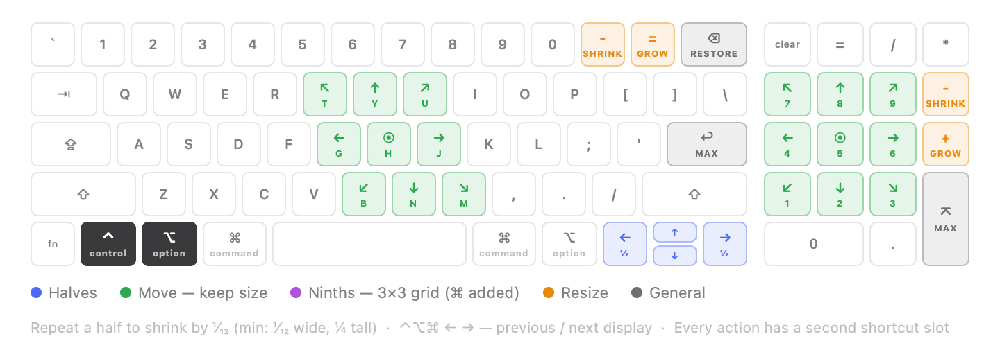
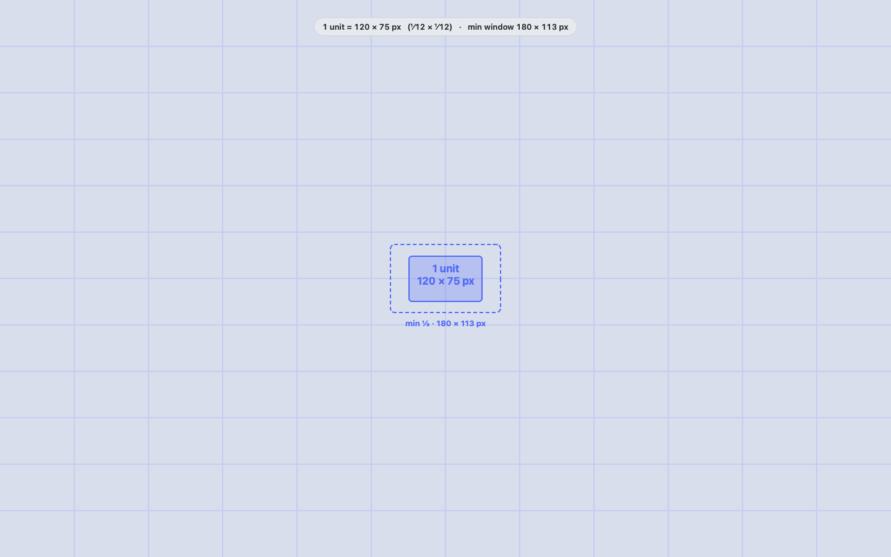

<p align="center">
  
</p>

<h1 align="center">Rejig</h1>

<p align="center">Keyboard-driven window manager for macOS — snap, move and resize windows without touching the mouse.</p>

<p align="center">
  <a href="https://github.com/cgpathos/rejig/releases/latest"></a>
  
  
</p>

---

## Install

**Homebrew**

```bash
brew tap cgpathos/rejig https://github.com/cgpathos/rejig
brew install --cask rejig
```

**Manual** — download the latest `Rejig-x.y.z.dmg` from [Releases](https://github.com/cgpathos/rejig/releases/latest), drag Rejig to Applications.

Rejig is signed with a Developer ID and notarized by Apple. On first launch it asks for **Accessibility** access (System Settings → Privacy & Security → Accessibility) — that's what lets it move other apps' windows.

## What it does

<p align="center"></p>

Everything lives on `⌃⌥` (Control + Option), matching the Magnet / Rectangle muscle memory. Every action also has a second shortcut slot — the numpad layout is preconfigured there.

| Group | Keys | What happens |
| --- | --- | --- |
| **Halves** | `⌃⌥` ← → ↑ ↓ | Snap to a half. Press again to shrink by ¹⁄₁₂ of the screen. |
| **Move** | `⌃⌥` T Y U / G H J / B N M | Move to one of 9 positions (numpad layout on the letters), keep size. `H` centers. |
| **Ninths** | `⌃⌥⌘` T Y U / G H J / B N M | Same 9 positions, but snap into a 3×3 grid cell. |
| **Resize** | `⌃⌥` = / − | Grow / shrink by one unit, anchored to where the window sits. `+` all the way to fullscreen, `−` back to exactly where you started. |
| **Maximize** | `⌃⌥` ↩ | Fill the screen. |
| **Restore** | `⌃⌥` ⌫ | Back to the frame before the first snap. |
| **Displays** | `⌃⌥⌘` ← → | Move to the previous / next display, keeping proportions. |

**Mouse**: hold `⌃⌥` and move the pointer to drag the window under it; hold `⌃⌥⌘` to resize from the nearest edge or corner. No clicking needed.

### Resize units

Grow / shrink steps are a fraction of the screen — horizontal and vertical are set separately in Settings, with a live preview of your monitor. While you adjust, the grid flashes over the whole screen so you can see exactly what one unit is.

<p align="center"></p>

## Settings

Menu bar icon → **Settings…** (or `⌘,` from the menu). Four tabs: General (gap, resize units), Shortcuts (list or keyboard view — every key remappable), Mouse, About. Rejig lives in the menu bar; it appears in `⌘Tab` only while the settings window is open.

## Requirements

macOS 14 Sonoma or later. Universal binary.

## Feedback

Issues and feature requests: [github.com/cgpathos/rejig/issues](https://github.com/cgpathos/rejig/issues) · pathos.myo@gmail.com

---

<sub>© 2026 pathos. Rejig is distributed as a signed, notarized Developer ID app; source is not public.</sub>
